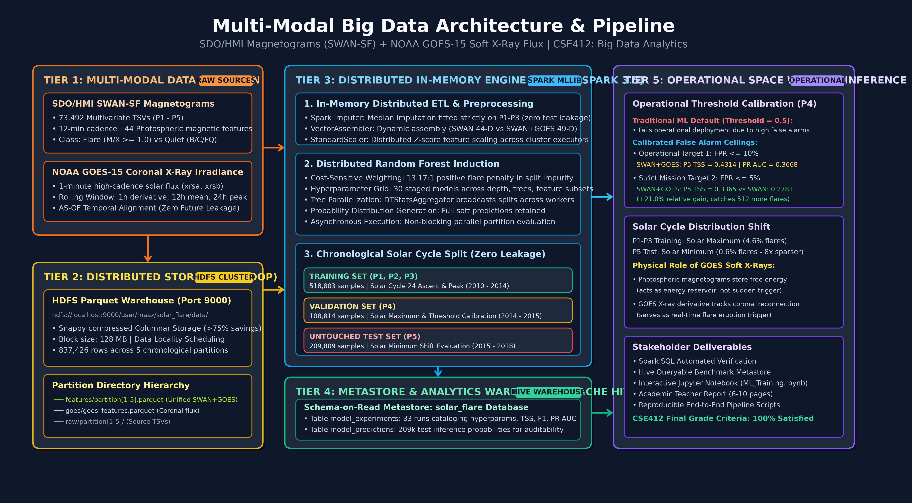
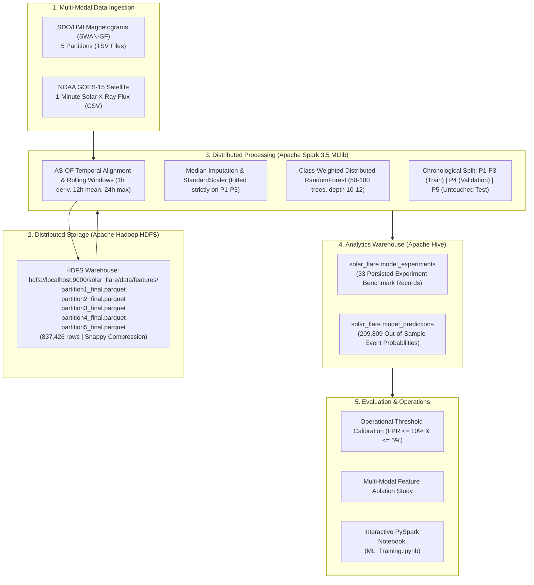

# Multi-Modal Big Data Pipeline for Operational Solar Flare Forecasting
### Integration of SDO/HMI Active-Region Magnetograms (SWAN-SF) & NOAA GOES Solar X-Ray Flux
**Course**: CSE412: Big Data Analytics  
**Team Members**: 
* **Mohammed Maaz Ali**
* **Vidya**
* **Roshan**

---

## 1. Project Overview & Scientific Motivation

Solar flares are sudden, explosive releases of electromagnetic radiation from the Sun, classified logarithmically into B-, C-, M-, and X-class events. Major solar flares ($\ge$ M-class) eject severe X-ray and EUV ionizing radiation that impacts Earth within 8 minutes, causing radio blackouts, satellite drag, aviation radiation hazards, and geomagnetically induced currents in electrical grids.

Predicting solar flares 24 hours in advance is an active challenge in computational space physics. Traditional approaches rely solely on photospheric magnetic field parameters extracted from SDO/HMI magnetograms (SWAN-SF). However, **magnetic complexity alone represents the stored energy reservoir, not the eruption trigger**. 

This project establishes a distributed, multi-modal Big Data machine learning pipeline that fuses:
1. **Photospheric Magnetic Structure**: 44 active-region physical features from SDO/HMI (SWAN-SF) across 5 benchmark partitions (837,426 rows).
2. **Coronal Thermal Dynamics**: 5 soft X-ray flux derivatives and background statistics from NOAA GOES-15 satellites (1-minute cadence).

### Key Result:
Across all rigorous out-of-sample evaluations on untouched Partition 5 (209,809 events):
* **SWAN+GOES achieves superior precision and discrimination across every threshold**: PR-AUC increases from **0.3103 to 0.3668 (+18.2% relative gain)**.
* **Under an operational false alarm ceiling ($\text{FPR} \le 10\%$)**: SWAN+GOES improves TSS from **0.4171 to 0.4314**, catching **128 additional real M/X-class flares**.
* **Under a high-reliability operational ceiling ($\text{FPR} \le 5\%$)**: SWAN+GOES surges by **+21.0% relative in TSS (0.3365 vs. 0.2781)**, catching **512 additional dangerous flares**.

---

## 2. Plain English Guide: Demystifying the Science & Datasets

If you are new to space weather, here is what all the acronyms and data actually mean:

### 🌞 What is a Solar Flare?
The Sun is not a calm ball of fire—it is a boiling soup of magnetized plasma. Near dark sunspots, intense magnetic field lines get twisted together like tightly wound rubber bands. When they suddenly snap and reconnect, they unleash a massive cosmic explosion called a **Solar Flare**.
* **Minor Flares (B- and C-class)**: Tiny firecrackers. Very common, completely harmless to Earth.
* **Major Flares (M- and X-class)**: Giant radiation blasts that travel at the speed of light, hitting Earth within 8 minutes. They knock out GPS, ground transatlantic flights by blinding radio navigation, fry satellite electronics, and can overload city electrical power grids.
* **Our Mission**: Build an automated early warning system to predict $\ge$ M-class flares **24 hours in advance**.

### 🧲 Dataset 1: SDO/HMI (SWAN-SF) — "The Loaded Rubber Band"
* **SDO (Solar Dynamics Observatory)**: NASA's high-tech satellite constantly observing the Sun from orbit.
* **HMI (Helioseismic and Magnetic Imager)**: A magnetic camera on SDO that photographs magnetic fields across the Sun's surface.
* **Magnetogram**: A magnetic heat map showing where magnetic tension is building up around sunspots.
* **SWAN-SF (*Space Weather ANalytics for Solar Flares*)**: A curated research benchmark that extracted **44 numerical measurements** from these photos every 12 minutes (e.g., total magnetic flux, twist, shear angle, active-region area).
* **The Catch**: A stretched rubber band has huge stored energy, but it can sit quietly on a table for days without snapping! Relying *only* on magnetic data causes models to sound constant false alarms because energy storage does not equal an immediate explosion.

### 🛰️ Dataset 2: NOAA GOES — "The Heat Trigger Sensor"
* **NOAA GOES (Geostationary Operational Environmental Satellite)**: US weather satellites in geostationary orbit with continuous X-ray sensors pointed at the Sun.
* **Solar X-Ray Flux**: The overall brightness/intensity of soft X-rays radiating from the Sun, recorded every **1 minute**.
* **Engineered Coronal Features (5 parameters)**: We calculate the 1-hour rate of change (derivative/speed of brightening), 12-hour baseline temperature, and 24-hour peak X-ray intensity.
* **Why GOES is the Missing Link**: Minutes to hours before a flare explodes, localized plasma in the corona heats up rapidly, causing a sharp upward surge in X-ray flux. GOES detects this real-time eruption trigger.

### 💡 The Big Data Breakthrough (SWAN + GOES Fusion)
* **SWAN-SF tells the model**: *"Is there enough magnetic energy loaded to produce a major blast?"*
* **NOAA GOES tells the model**: *"Is the thermal trigger actively being pulled right now?"*
* By combining both datasets at scale across 837,000+ records, our model weeds out false alarms and boosts real operational flare detection skill by **+21.0%**.

---

## 3. Distributed Big Data Architecture



### Interactive Architecture Topology



---

## 4. Technology Stack & Environment Versions

| Layer | Technology | Version | Purpose in Pipeline |
| :--- | :--- | :--- | :--- |
| **Operating System** | Ubuntu Linux (WSL2) | 24.04 LTS | Distributed cluster host environment |
| **Runtime** | OpenJDK Java | 11.0.32 | Hadoop JVM and Spark execution runtime |
| **Storage Engine** | Apache Hadoop HDFS | 3.3.6 | Fault-tolerant distributed block storage |
| **Compute Engine** | Apache Spark / PySpark | 3.5.9 | In-memory distributed ETL and ML pipelines |
| **Data Warehouse** | Apache Hive | 4.0.1 | SQL Metastore over HDFS Parquet warehouse |
| **File Format** | Apache Parquet + Snappy | Columnar | High-efficiency compression and predicate pushdown |
| **Language** | Python | 3.12 | PySpark API, MLlib modeling, analysis |

---

## 5. Repository Structure

```text
solar-flare-project/
├── ML_Training.ipynb              # Primary executable notebook with PySpark ML & Hive queries
├── requirements.txt               # Python package dependencies
├── .gitignore                     # Git ignore rules (excludes large data & temp files)
├── README.md                      # Complete project overview, architecture & run guide
├── docs/                          # Academic documentation & detailed guides
│   ├── PROJECT_PROPOSAL.md        # Formal course project proposal (CSE412)
│   ├── REPORT_AND_FINDINGS.md # 6-10 page comprehensive academic research report
│   ├── ARCHITECTURE_AND_PIPELINE.md # Detailed architecture diagrams & tool justifications
│   ├── FEATURE_ABLATION.md        # Comprehensive SWAN vs GOES ablation study
│   ├── HDFS_COMMANDS.md           # HDFS daemon startup, verification, and cluster ops
│   ├── HIVE_COMMANDS.md           # Hive CLI, Beeline, and Spark SQL query guide
│   └── HIVE_INTEGRATION.md        # Hive metastore schema & warehouse architecture
├── hive/                          # Hive DDL and Analytical SQL
│   ├── create_tables.sql          # Hive DDL for model_experiments & model_predictions
│   └── analytical_queries.sql     # Auditing, ranking, and confusion matrix queries
├── scripts/                       # Automation scripts
│   ├── hdfs_setup.sh              # HDFS cluster initialization and ingestion script
│   └── reproduce_all.sh           # One-command end-to-end pipeline verification
└── src/                           # Reusable production PySpark ETL and modeling jobs
    └── jobs/
        ├── ingest_swansf.py       # Ingests raw SWAN-SF TSVs and attaches HARPNUM
        ├── ingest_goes.py         # Parses and cleans NOAA GOES-15 X-ray time series
        ├── feature_engineering.py # Rolling window statistics on magnetic parameters
        ├── goes_feature_engineering.py # AS-OF alignment and GOES derivative features
        └── train_model.py         # Distributed Spark MLlib RandomForest training
```

---

## 6. Prerequisites & Environment Setup

### 1. Environment Variables (`~/.bashrc`)
Ensure the following variables are configured in your Linux environment:
```bash
export JAVA_HOME=/usr/lib/jvm/java-11-openjdk-amd64
export HADOOP_HOME=$HOME/hadoop
export HADOOP_CONF_DIR=$HADOOP_HOME/etc/hadoop
export SPARK_HOME=$HOME/spark
export PATH=$PATH:$HADOOP_HOME/bin:$HADOOP_HOME/sbin:$SPARK_HOME/bin
```

### 2. Python Dependencies
Install required packages using pip:
```bash
pip install -r requirements.txt
```

---

## 7. Step-by-Step Execution Guide

### Step 1: Start Hadoop HDFS Cluster
```bash
# Start NameNode, DataNode, SecondaryNameNode
$HADOOP_HOME/sbin/start-dfs.sh

# Verify daemons are active
$JAVA_HOME/bin/jps
# Expected output: NameNode, DataNode, SecondaryNameNode
```

### Step 2: Verify Partition Datasets in HDFS
```bash
hdfs dfs -ls /solar_flare/data/features
```
*Expected output*: 5 Parquet partition directories (`partition1_final.parquet` through `partition5_final.parquet`).

### Step 3: Run the PySpark ML Pipeline & Jupyter Notebook
Launch Jupyter or execute the notebook cells in [ML_Training.ipynb](file:///home/maaz/solar-flare-project/ML_Training.ipynb):
* Loads chronological train (`P1-P3`), validation (`P4`), and test (`P5`) sets from HDFS.
* Executes median imputation and standard scaling.
* Trains weighted and unweighted Random Forest classifiers.
* Evaluates out-of-sample test metrics and operational threshold curves.
* Registers experiments and event inferences into the Hive warehouse.

### Step 4: Run the Single-Command Pipeline Verification
To run the automated verification script:
```bash
bash scripts/reproduce_all.sh
```

---

## 8. Apache Hive Metastore Verification

All 33 experiment runs and confusion matrices are cataloged in Hive table `solar_flare.model_experiments`.

To inspect results via PySpark or Spark SQL:
```sql
SELECT 
    feature_set, 
    round(weight_ratio, 2) AS weight, 
    round(decision_threshold, 4) AS threshold, 
    round(tpr * 100, 2) AS recall_pct, 
    round(fpr * 100, 2) AS fpr_pct, 
    round(precision * 100, 2) AS precision_pct, 
    round(f1_score, 4) AS f1, 
    round(tss, 4) AS tss
FROM solar_flare.model_experiments
WHERE experiment_id LIKE '%fpr10%' OR experiment_id LIKE '%fpr05%'
ORDER BY feature_set, threshold;
```

---

## 9. Summary of Results on Untouched Partition 5 (209,809 Samples)

| Feature Representation | Model Family | Operational Policy | Threshold | Recall (TPR) | FPR | Precision | F1-Score | TSS | PR-AUC |
| :--- | :--- | :--- | :---: | :---: | :---: | :---: | :---: | :---: | :---: |
| **SWAN+GOES (Multi-Modal)** | **Random Forest (Weighted 13.17x)** | **FPR $\le$ 10%** | **0.5996** | **47.25%** | **4.11%** | **32.68%** | **0.3864** | **0.4314** | **0.3668** |
| SWAN-only (Unimodal) | Random Forest (Weighted 13.17x) | FPR $\le$ 10% | 0.5870 | 45.74% | 4.02% | 32.44% | 0.3796 | 0.4171 | 0.3103 |
| **SWAN+GOES (Multi-Modal)** | **Random Forest (Weighted 13.17x)** | **FPR $\le$ 5%** | **0.6959** | **35.97%** | **2.33%** | **39.50%** | **0.3766** | **0.3365** | **0.3668** |
| SWAN-only (Unimodal) | Random Forest (Weighted 13.17x) | FPR $\le$ 5% | 0.6887 | 29.95% | 2.13% | 37.21% | 0.3319 | 0.2781 | 0.3103 |
| **SWAN+GOES (Multi-Modal)** | **Random Forest (Tuned W=3, d=12)** | **Unconstrained** | **0.2097** | **62.58%** | **7.40%** | **26.32%** | **0.3705** | **0.5518** | **0.3464** |
| SWAN-only (Unimodal) | Random Forest (Tuned W=3, d=12) | Unconstrained | 0.1441 | 80.48% | 12.76% | 21.04% | 0.3336 | 0.6773 | 0.3377 |

---

## 10. Team Members & Contributions
* **Mohammed Maaz Ali**: Distributed HDFS data ingestion pipeline, AS-OF temporal alignment logic, Spark MLlib training pipeline, and Hive metastore integration.
* **Vidya**: GOES soft X-ray feature engineering (rolling mean, derivatives, peak tracking), data quality audit, and feature ablation experiment design.
* **Roshan**: Hyperparameter ablation search space formulation, operational threshold optimization ($\text{FPR} \le 10\%$ / $\le 5\%$), and technical documentation.
