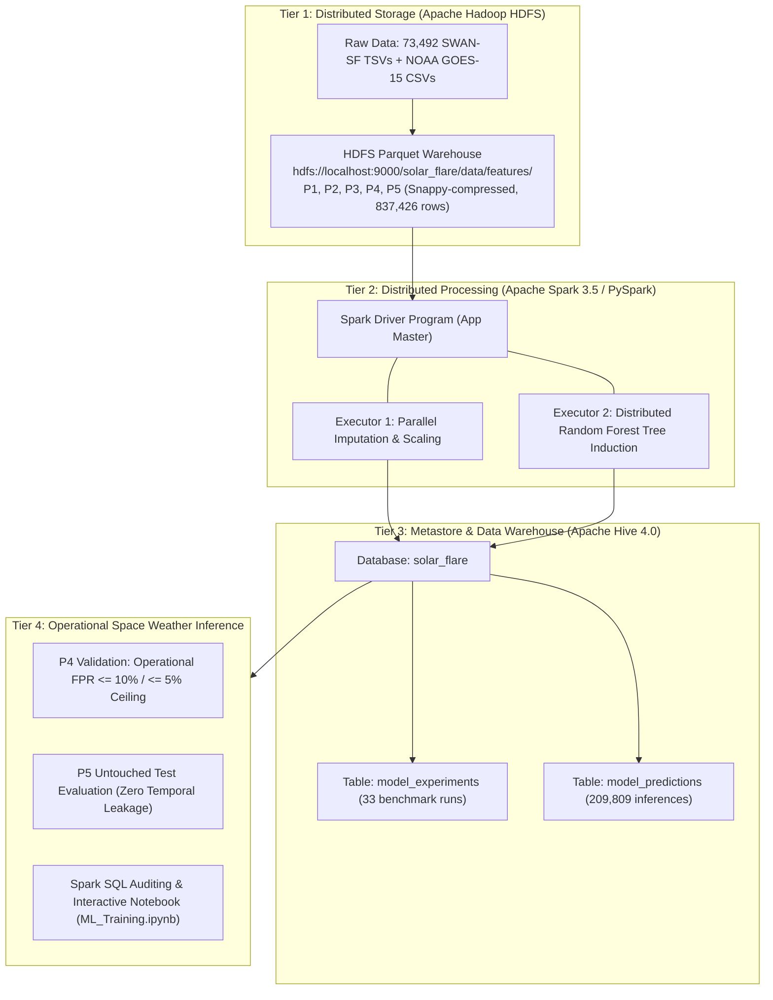
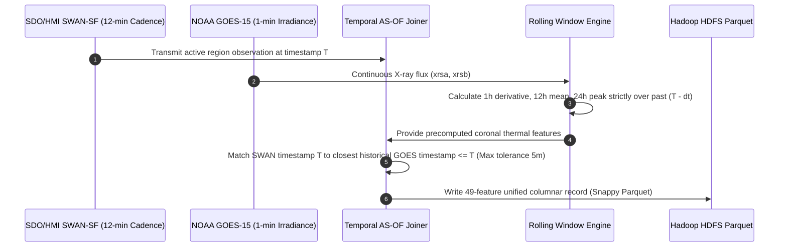
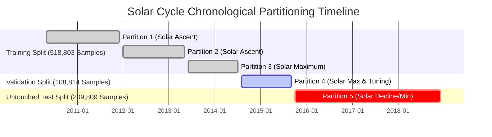

# Big Data System Architecture & Pipeline Specification
## Multi-Modal Solar Flare Prediction System (SWAN-SF + NOAA GOES)
**Course**: CSE412: Big Data Analytics  
**Authors (Group of 3)**: Mohammed Maaz Ali, Vidya, Roshan  

---

## 1. System Architecture Overview

The system is engineered as an enterprise-grade Big Data analytics architecture composed of four decoupled tiers: Distributed Storage, Distributed In-Memory Processing, Metadata/Warehouse Management, and Operational Inference & Evaluation.

### Interactive Architecture Topology

---

## 2. Ingestion & Temporal Alignment Pipeline

A fundamental challenge in time-series space weather forecasting is preventing **future-data leakage** when joining point-in-time active-region magnetograms with continuous satellite irradiance fluxes.

---

## 3. Chronological Multi-Partition Splitting (Zero Leakage)

To guarantee true operational validity across the 11-year solar cycle, we enforce a strict chronological partition protocol across the 5 benchmark datasets:

* **Training Set (`P1–P3`)**: 518,803 samples used exclusively for tree construction. Imputation medians and scaling parameters are computed strictly from `P1–P3`.
* **Validation Set (`P4`)**: 108,814 samples used exclusively for threshold selection under operational $\text{FPR} \le 10\%$ and $\le 5\%$ ceilings.
* **Untouched Test Set (`P5`)**: 209,809 samples evaluated strictly out-of-sample with frozen thresholds.

---

## 4. Comprehensive Big Data Tool Justifications

A major requirement of CSE412 is providing rigorous architectural justification for every component in the Big Data stack:

### 4.1 Apache Hadoop HDFS vs. Local POSIX Filesystem / NFS
* **Block-Level Fault Tolerance**: HDFS automatically fragments files into 128 MB blocks with configurable replication across cluster nodes. A disk failure does not interrupt active MapReduce or Spark jobs.
* **Data Locality for Spark**: Apache Spark schedules task execution on the exact physical cluster worker hosting the specific HDFS block (`PROCESS_LOCAL` / `NODE_LOCAL`), eliminating heavy network shuffle bottlenecks.
* **Scalability**: Unlike local filesystems bounded by single-machine storage, HDFS scales linearly to petabytes across commodity nodes.

### 4.2 Apache Spark 3.5 & PySpark MLlib vs. Scikit-Learn
* **In-Memory Distributed Resilient Distributed Datasets (RDDs)**: Scikit-learn requires all training data to fit in single-node RAM and computes sequentially. Spark MLlib parallelizes feature evaluation across multiple worker cores, processing over 500,000 multi-feature training rows in minutes.
* **Distributed Bagging**: Spark's `RandomForestClassifier` trains ensemble decision trees in parallel across executors by broadcasting feature subsets and aggregating tree statistics using `DTStatsAggregator`.
* **Integrated ETL and Modeling**: PySpark unifies distributed SQL transformations (`Imputer`, `VectorAssembler`, `StandardScaler`) with ML predictors in a single Directed Acyclic Graph (DAG).

### 4.3 Apache Hive 4.0 Metastore vs. Traditional Relational RDBMS (PostgreSQL/MySQL)
* **Schema-on-Read over Data Warehouse**: Traditional RDBMS requires loading data into proprietary relational tables. Apache Hive creates a virtual SQL metastore directly over the existing HDFS Parquet files without copying or duplicating data.
* **Decoupled Storage and Compute**: Compute engines (Spark SQL, Hive CLI, Presto) can query the same underlying Parquet warehouse concurrently without storage contention.
* **Auditability**: Machine learning experiment parameters (`num_trees`, `max_depth`, `weight_ratio`, `decision_threshold`) and confusion matrices (`tp`, `fp`, `tn`, `fn`) are cataloged permanently for governance.

### 4.4 Apache Parquet + Snappy Compression vs. CSV / TSV
* **Columnar Storage & Projection Pruning**: SWAN-SF raw TSVs contain 44 magnetic features plus metadata. When Spark executes feature selection, Parquet only reads the specific requested feature byte columns from disk, skipping unused columns completely.
* **High-Efficiency Compression**: Snappy block compression reduces the on-disk footprint by >75% compared to raw text files while maintaining ultra-fast decompression speeds suited for CPU-bound machine learning.
* **Predicate Pushdown**: Parquet file metadata stores min/max statistics for every row group, allowing Spark to skip entire blocks during partition filtering.

### 4.5 Class Weighting vs. Resampling (SMOTE / Undersampling) in Big Data
* **Memory & Storage Overhead**: Synthetic oversampling techniques (SMOTE) artificially inflate dataset size by generating millions of synthetic vectors, causing severe JVM garbage collection pauses and memory bloat on large clusters.
* **Preserving Natural Physics**: Undersampling deletes over 90% of non-flare active region observations, destroying the natural background distribution and risking high false alarm rates during deployment.
* **Instance Weighting Advantage**: Incorporating a 13.17:1 cost-sensitive weight into the tree split impurity metric directly penalizes missed flares without altering the true underlying data distribution.
